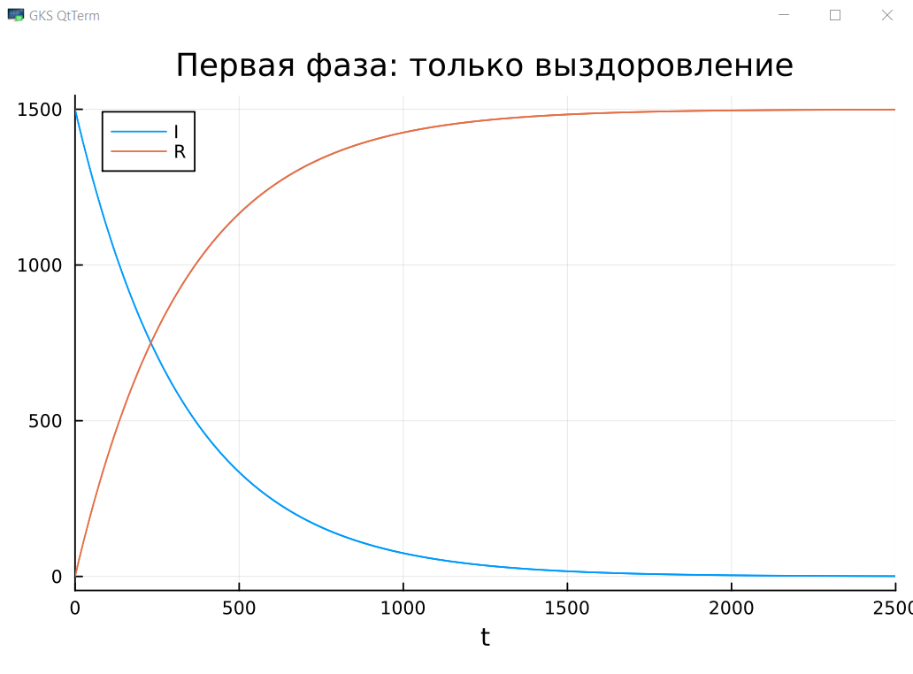
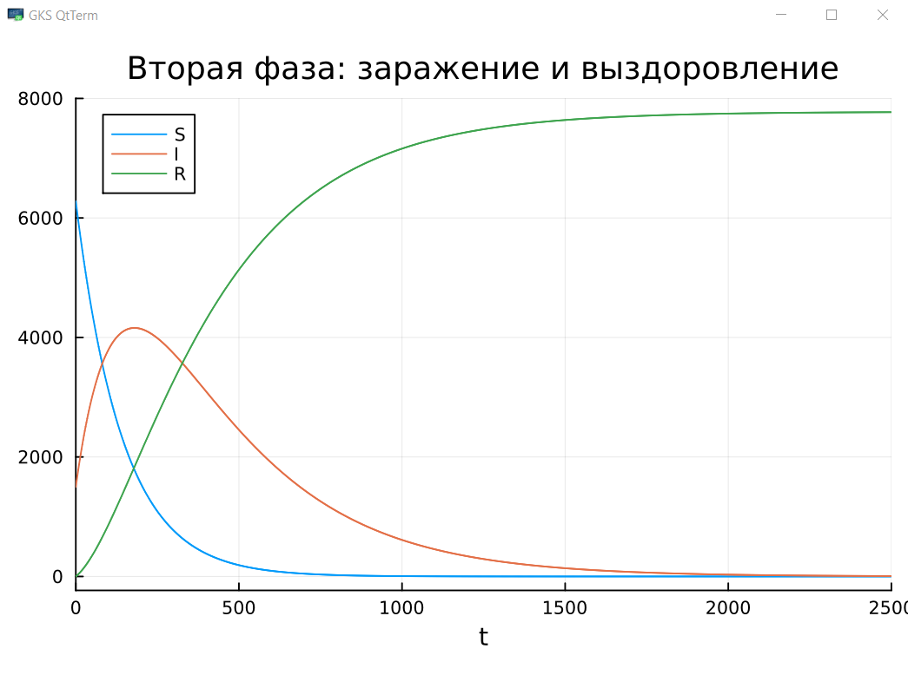
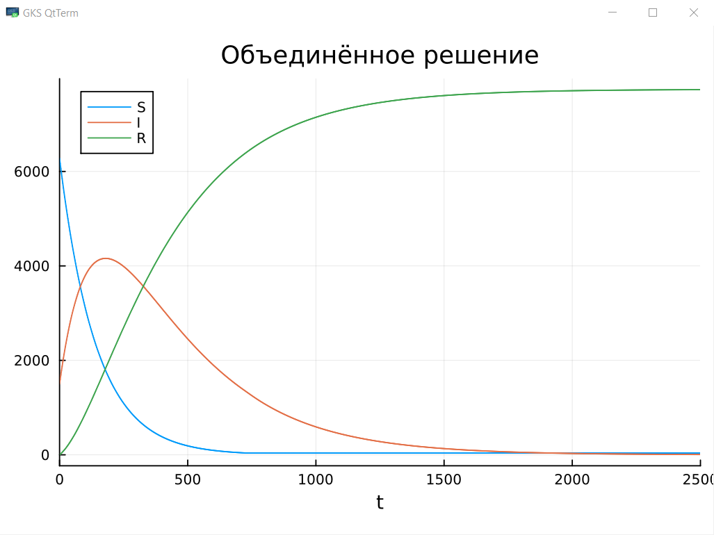
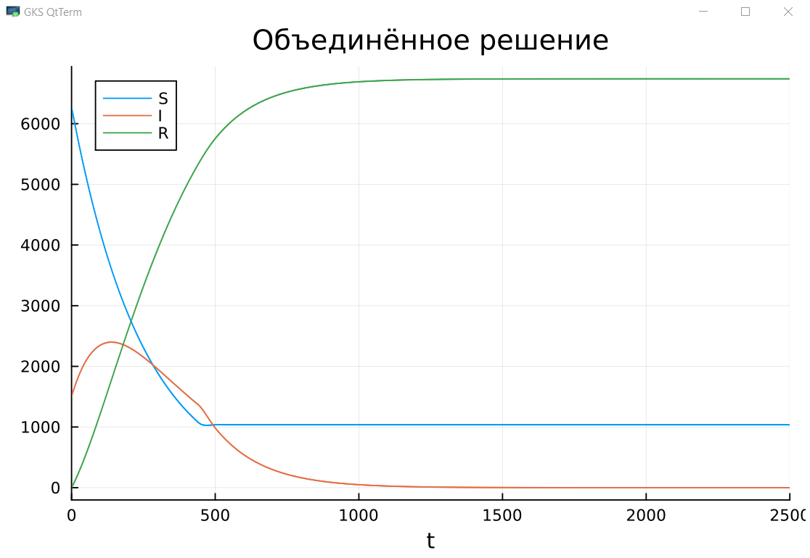
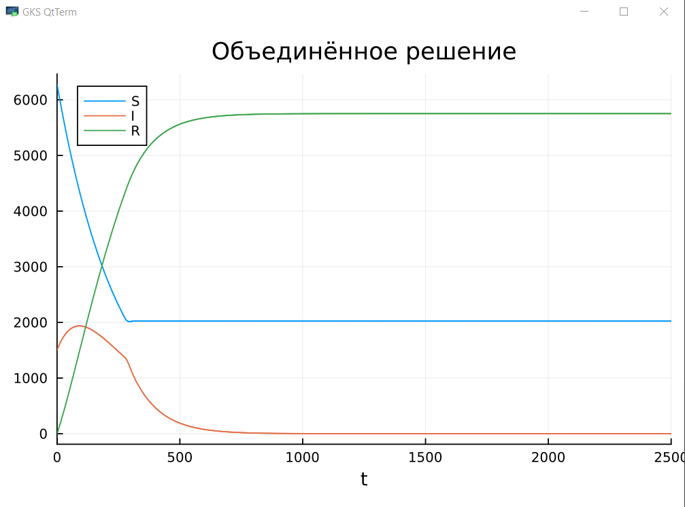

---
## Front matter
lang: ru-RU
title: Групповой проект номер №5
subtitle: Дисциплина "Научное программирование"
author:
  - Супонина Анастасия Павловна,
  - Лобов Михаил Сергеевич,
  - Нирдоши Всеволод Раджендер
institute:
  - Кафедра теории вероятностей и кибербезопасности
  - Российский университет дружбы народов имени Патриса Лумумбы, Москва, Россия
date: 05 Октября 2024

## i18n babel
babel-lang: russian
babel-otherlangs: english

## Formatting pdf
toc: false
toc-title: Содержание
slide_level: 2
aspectratio: 169
section-titles: true
theme: metropolis
header-includes:
 - \metroset{progressbar=frametitle,sectionpage=progressbar,numbering=fraction}
---


## Постановка задачи

 В одном изолированном городе под названием “Амбрелла Сити” вспыхнула эпидемия чумы. Известно, что из всех проживающих на острове (N=7777) в момент начала эпидемии (t=0) число заболевших чумой людей (являющихся распространителями инфекции) I=1500, А число выздоровевших (recovered) людей с иммунитетом к болезни R=0. Таким образом, число людей восприимчивых к болезни, но пока здоровых, в начальный момент времени S=N-I-R. Вместимость зоны изоляции I* = 1300.

Мы имеем дело с "Задачей об эпидемии" — это математическая модель, описывающая распространение инфекционных заболеваний в популяции.

## SIR 

Модель SIR является одной из наиболее фундаментальных эпидемиологических моделей. Расшифровывается как Susceptible (Восприимчивые), Infected (Инфицированные), и Recovered (Выздоровевшие).
Это одна из простейших моделей, которая была предложена шотландскими учёными Уильямом Огилви Кермаком и Андерсоном Греем Маккендриком около 100 лет назад.

:::::::::::::: {.columns align=center}
::: {.column width="15%"}

:::

::: {.column width="60%"}
 
::: 

::: {.column width="15%"}

:::
::::::::::::::

---

Она часто используется для моделирования задачи об эпидемии.

Данная модель позволяет создавать симуляции, которые позволяют визуализировать и анализировать разные эпидемиологические сценарии.

Рассмотрим в нашей работе один из них.

## Математическая модель

Математическкая модель предполагает использование дифференциальных уравнений.

Скорость изменение числа восприимчивых к болезни особей (S(t)):

:::::::::::::: {.columns align=center}
::: {.column width="30%"}

:::

::: {.column width="40%"}
 
::: 

::: {.column width="30%"}

:::
::::::::::::::

Скорость изменение числа инфицированных особей, являющихся распространителями (I(t)):

:::::::::::::: {.columns align=center}
::: {.column width="30%"}

:::

::: {.column width="40%"}
 
::: 

::: {.column width="30%"}

:::
::::::::::::::

---

Скорость изменение числа особей с иммунитетом (переболевших) (R(t)):

:::::::::::::: {.columns align=center}
::: {.column width="30%"}

:::

::: {.column width="40%"}
 
::: 

::: {.column width="30%"}

:::
::::::::::::::

где α и β - коэффициенты заболевания и выздоровления соответственно.

## Параметры задачи

```julia
N = 7777  # Общее количество особей в популяции
# Она делится на 3 группы (по обозначениям SIR) :
I = 1500   # Количество инфицированных особей
R = 0     # Количество выздоровевших особей
S = N - I - R  # Количество здоровых, восприимчивых к инфекции особей
# В дифференциальных уравнениях модели у нас появляются два коэффициента:
a = 0.007  # Коэффициент заболевания
b = 0.003  # Коэффициент выздоровления
# Если I < crit_I, то все больные изолированы.
crit_I = 1300 # Критическое значение инфицированных
# Начальные условия
u0 = [S, I, R]
tspan = (0.0, 2500.0)
```

## Библиотека `DifferentialEquations.jl`
 
  Julia предоставляет мощную библиотеку для решения обыкновенных дифференциальных уравнений (ODE) с помощью `DifferentialEquations.jl`. Функция `ODEProblem` задает дифференциальное уравнение, начальные условия и временной промежуток для решения.
  Использование этой библиотеки позволят нам избежать ошибок, связанных с тем, что мы решаем не просто дифференциальные уравнения, а алгебродифференциальные уравнения. При решении задачи таким методом, число людей в нашей ограниченной популяции всегда остается одинаковым.

```julia
import Pkg
Pkg.add("DifferentialEquations")

prob_combo = ODEProblem(combo_case!, u0, tspan, p_combo)
```

## Программная реализация

```julia
# Определение первой фазы, где происходит только выздоровление
function first_case!(du, u, p, t)
    _, b = p
    du[1] = 0  # Количество восприимчивых особей остается неизменным
    du[2] = -u[2] * b  # Количество инфицированных уменьшается за счет выздоровления
    du[3] = u[2] * b   # Количество выздоровевших увеличивается
end
```

В первом условии мы рассматриваем случай, когда I>crit_I. 

Во втором когда все больные изолированы.

## Реализация - два случая



```julia
# Определение второй фазы, где происходят как заражения, так и выздоровления
function second_case!(du, u, p, t)
    a, b = p
    du[1] = -a * u[1]              # Количество восприимчивых особей уменьшается за счет заражений
    du[2] = a * u[1] - u[2] * b     # Количество инфицированных изменяется из-за заражений и выздоровлений
    du[3] = u[2] * b               # Количество выздоровевших увеличивается
end
```



## Реализация - различие итогов графиков

Мы объединяем 2 предыдущих условия.
Различные значения a и b будет соответствовать различным сценариям развития эпидемии.

```julia
function combo_case!(du, u, p, t)
    a, b, crit_I = p
    if u[2] > crit_I
        du[1] = -a * u[1]          # Уменьшается за счет заражений
        du[2] = a * u[1] - u[2] * b
        du[3] = u[2] * b
    else
        du[1] = 0                  # Остается неизменным
        du[2] = -u[2] * b          
        du[3] = u[2] * b       
    end
end
```

a = 0.007  b = 0.003

a = 0.004  b = 0.006 

a = 0.004  b = 0.009  

{height=125}
{height=125}
{height=125}

В зависимости от скорости заражения и скорости выздоровления, становится возможно сдержать инфекцию, что видно на графиках. Понимая, в каком сценарии распространения болезни мы находимся, позволяет эффективно контролировать ситуацию.

## Вывод

В работе рассмотрена задача моделирования эпидемии с помощью модели SIR, которая разделяет популяцию на восприимчивых, инфицированных и выздоровевших. Используя библиотеку `DifferentialEquations.jl`, мы смогли гибко учитывать критический порог заражения, меняя условия распространения инфекции.

Построенная нами модель позволяет наглядно увидеть динамику эпидемии, а также эффективно прогнозировать и контролировать распространения инфекций.

## {.standout}

Спасибо за внимание!